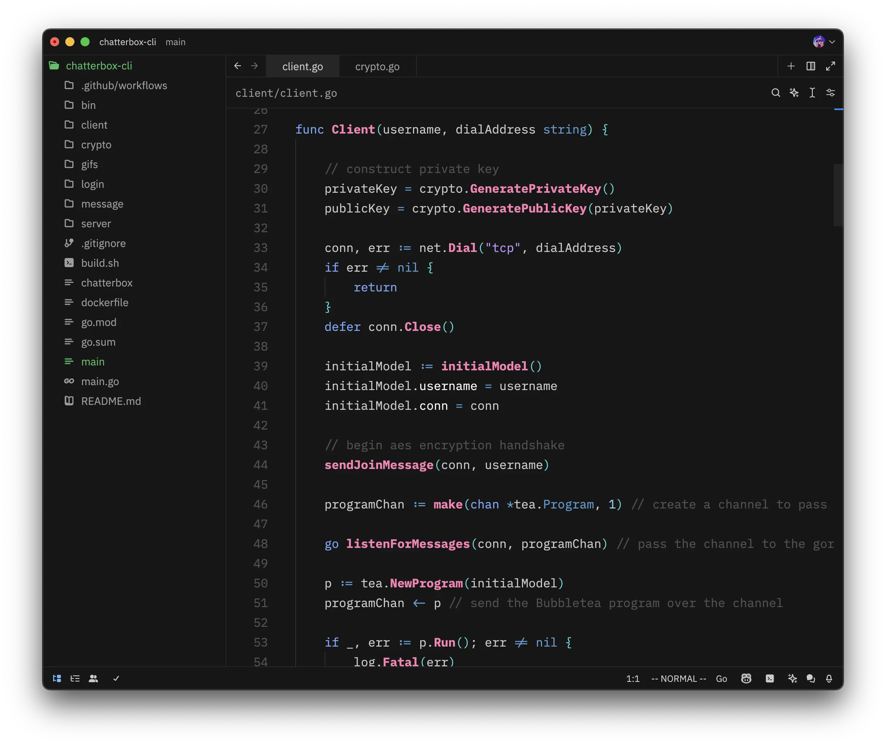
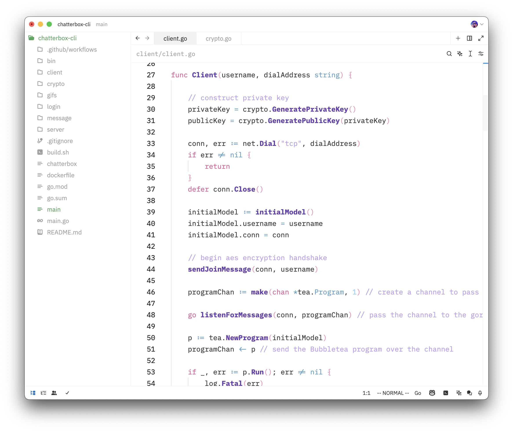
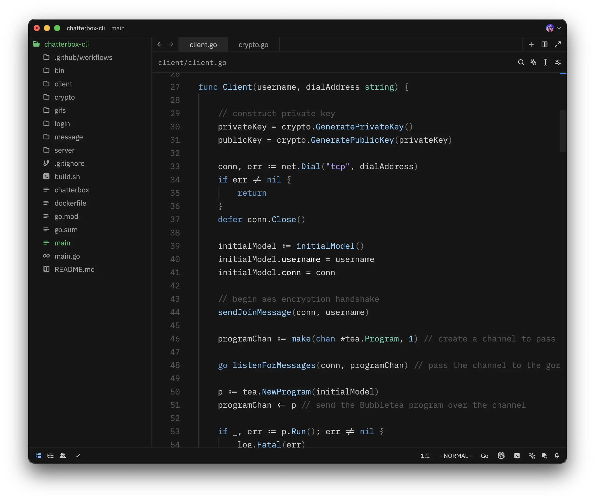

# Oxocarbon for Zed

**Oxocarbon for Zed**
A dark and light theme for Zed inspired by the [IBM Carbon Design System](https://carbondesignsystem.com/guidelines/color/overview/#themes) and based on the Neovim oxocarbon theme.

The color palette is rooted in the same principles that define the IBM design system: a balance between humanity and technology, nature and machine. It features a vibrant set of blues, accompanied by industrial grays, all with a subtle digital glow. The oxocarbon palette harmonizes the blues across the spectrum, even adding hints of blue to the reds, creating a cohesive visual experience. The result is a design that embodies IBM’s digital identity while remaining useful and aesthetically balanced.

## Features
- Dark and Light themes
- Optimized for readability with a focus on a vibrant blue palette and nuanced grays
- Minimal distraction, highlighting core elements with subtle color accents
- Based on the [oxocarbon.nvim](https://github.com/nyoom-engineering/oxocarbon.nvim.git) colorscheme

## Assets
- Dark Mode Preview: 
- Light Mode Preview: 
- Combined Palette: 

## License

This project is licensed under the GNU License
